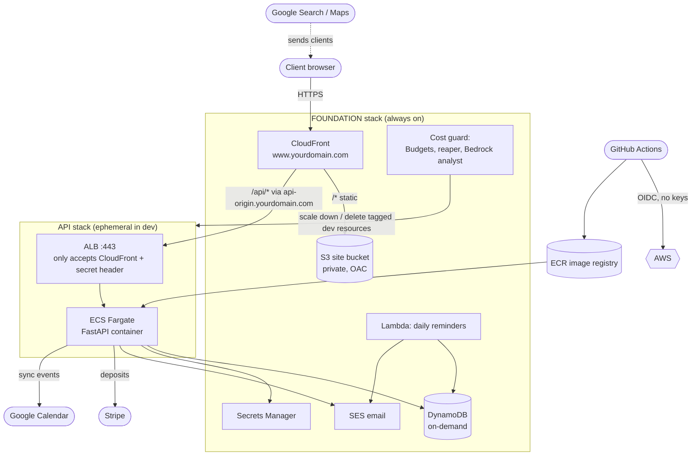

# Architecture

Booking site for AfterHourzKutz: React frontend, Python (FastAPI) API, AWS infrastructure in Terraform, delivered through GitHub Actions with approval gates.

## The short answers

**Should it be containerized?** The API, yes. The React site, no.

- The **API is a container** (Docker image, ECR, ECS Fargate). One immutable artifact is built per commit, tested in CI, run in dev, and promoted unchanged to production. Local, CI, and prod run the same image. That is the real value of containers here, and it is what makes rollbacks trivial: redeploy an old tag.
- The **React site is not a container.** It compiles to static files. Serving those from S3 behind CloudFront is cheaper, faster, and better for Google rankings than running a web server in a container to hand out files.

**Can dev be destroyed every day?** Yes, and the design is built around it. Infrastructure is split into two Terraform stacks with different lifetimes:

| Stack | Lifetime | Contains | Idle cost |
|---|---|---|---|
| `foundation` | always on | DynamoDB, S3, CloudFront, TLS cert, DNS, secrets, reminders Lambda, cost tooling | pennies |
| `api` | destroyed nightly in dev | VPC, load balancer, ECS Fargate service | zero when destroyed |

Client data survives teardown because it lives in DynamoDB, not in the containers. The public site stays up while the API is down (booking just shows an error until the API returns).

**Bedrock for cost control?** Used as an **analyst, not an executioner.** See [Cost control](#cost-control-three-layers).

## Diagram

## Components and why

| Piece | Choice | Reasoning |
|---|---|---|
| Frontend | React (Vite) on S3 + CloudFront | Static hosting is the cheapest and fastest option. One CloudFront domain also serves `/api/*`, so there is no CORS and only one hostname to secure. |
| API | FastAPI in Docker on ECS Fargate | Matches your Python stack. Fargate means no servers to patch. Rolling deploys with automatic rollback (deployment circuit breaker). |
| Database | DynamoDB, on-demand | Pay per request, nothing to run or patch, and it survives the nightly teardown. The access patterns are simple key lookups, which suits it. Point-in-time recovery is on in prod. |
| Double-booking protection | Conditional transactional writes | Each 30-minute slot is its own item; booking writes all needed slots in one transaction that fails if any is taken. Two people can never hold the same time, even under concurrent requests (see `backend/app/repo.py`). |
| Auth | Google sign-in, then our own short-lived JWT | Clients need no password. Admins are Google accounts on an allowlist. Nothing sensitive is stored. |
| Payments | Stripe Checkout deposits | Card data never touches our servers. A webhook confirms the booking. Unpaid slots are held for 31 minutes and then released. A late payment for a lost slot is auto-refunded. |
| Calendar | One-way sync to Google Calendar via service account | Bookings appear on your phone's calendar. |
| Email / SMS | SES (email), SNS (SMS, off by default) | See [Known limitations](#known-limitations-and-next-steps) for SMS caveats. |
| Reminders | Lambda + EventBridge Scheduler, 4pm daily | Lives in the foundation stack so reminders still send while dev is torn down. |
| Registry | One ECR repo shared by all environments, immutable tags | Build once, promote the exact same image. A tag can never be silently swapped. |
| CI to AWS | GitHub OIDC roles | No AWS keys stored in GitHub. The prod role can only be assumed from the `production` GitHub environment. |

### How the two stacks connect
CloudFront (foundation) must point at the load balancer (API stack), but the load balancer is recreated every night with a new address. They are joined by a stable DNS name, `api-origin.<site>`. The API stack points that name at whichever load balancer currently exists. The ALB has a certificate for that name, so CloudFront-to-ALB traffic is HTTPS end to end, and the ALB rejects any request that does not carry CloudFront's secret header and does not come from CloudFront's IP ranges.

### Data model (single DynamoDB table)

| Item | Key | Purpose |
|---|---|---|
| Appointment | `APPT#<id>` / `META` | The booking. GSI1 by client email, GSI2 by day. |
| Slot | `SLOTS#<date>` / `HH:MM` | One per 30-minute block held. The conditional write on this item prevents double booking. |
| Config | `CONFIG` / `SHOP` | Opening hours and days off, editable in the admin dashboard. |

## Security model

- Private S3 bucket (Origin Access Control), HTTPS only, HSTS and security headers on every response.
- ALB reachable only from CloudFront (managed prefix list plus secret header).
- API tasks accept traffic only from the ALB. Task role is limited to this environment's table and to sending mail from one address.
- Secrets live in Secrets Manager and are injected at container start. Terraform creates the secret shell and never overwrites your real values.
- CI roles: the plan role is read-only and explicitly denied customer data. Deploy roles are limited to the services Terraform manages, cannot edit the CI roles themselves, and the prod role is bound to the `production` environment.
- Container: non-root user, pinned dependencies, vulnerability scan in CI (fails on fixable HIGH/CRITICAL).
- Startup refuses insecure configuration: a default JWT secret or the dev-login backdoor outside `ENV=local` stops the app from booting.
- CSP is shipped in **report-only** mode. Load the site, check the console, then switch the header to enforcing (see `modules/edge/main.tf`).

## Cost control (three layers)

AWS has **no hard spending cap**, and cost data lags by up to a day. So the strategy is prevention first, limits second, explanation third.

1. **Prevent.** A GitHub Actions job destroys the dev API stack every night (03:00 UTC). An AWS-side scheduled Lambda sweeps dev at 04:00 ET as a backstop in case GitHub's job fails or GitHub pauses scheduled workflows (it does after 60 idle days).
2. **Limit.** An AWS Budget per environment (filtered by the `Env` cost tag). At 50% and 80% it emails you. At 100% of actual spend it triggers the **reaper Lambda**, which scales the environment's ECS services to zero and deletes its load balancer. The reaper is deterministic, only touches resources tagged `Project=afterhourz`, `Env=<this env>`, `Ephemeral=true`, and in **prod it only reports**, never acts.
3. **Explain.** A daily Lambda pulls the last 14 days from Cost Explorer, has an Amazon Bedrock model (Claude Haiku by default) explain what is driving spend and what changed, and emails you. It also runs a simple rule-based spike check, so the email is useful even if Bedrock is unavailable. Cost Anomaly Detection is enabled account-wide as well.

**Why the AI does not get delete permissions.** A language model can be wrong, and the cost of a wrong delete on production infrastructure is far higher than the cost of an email. So the model reads and advises; fixed rules with a narrow, tag-scoped IAM policy act. If you want the AI to be able to *propose* a teardown, the safe pattern is: it opens a GitHub issue or triggers a workflow that waits for your approval, rather than deleting directly.

## Cost expectations (approximate; verify with the AWS Pricing Calculator)

These are estimates from public us-east-1 list prices as I know them, not quotes.

- **Dev, up about 10 hours a day, on Spot:** roughly **$8-12/month** (the ALB and its public IPs dominate), plus about $1-2 of always-on items.
- **Prod, 2 on-demand tasks:** roughly **$45-60/month**. The load balancer, public IPv4 addresses, and Fargate are around 90% of that.
- **Always-on foundation items:** Route 53 zone about $0.50, one secret about $0.40, DynamoDB/S3/CloudFront/Lambda near zero at this traffic.

**An honest note on right-sizing:** for a one-chair barbershop, Lambda behind API Gateway would cost roughly $3-10/month and scale to zero. Fargate was chosen here because you asked for a containerized, production-style setup with a real pipeline, which is also the more valuable thing to show in an infrastructure portfolio. If the bill ever matters more than the showcase, only the `modules/api` module needs replacing; everything else stays.

## Known limitations and next steps

- **Not validated end to end against real services.** The API and Lambdas have automated tests (moto for AWS, and Stripe's real signature-verification code), the frontend was clicked through in a real browser against a local API, and the workflows pass `actionlint`. But Terraform was formatted and syntax-checked, not applied, the container was not built here, and Google sign-in, Google Calendar, Stripe Checkout, SES, and Bedrock were exercised through fakes only. Expect a small round of fixes on first deploy; do it in dev first.
- **SES starts in sandbox** (can only email verified addresses). Request production access.
- **SMS:** US carriers require registration (10DLC or toll-free) before SNS can deliver texts. SMS is off by default.
- **Single timezone.** Slots are stored in shop-local time. That is right for one shop; it would need work for several locations.
- **No WAF and no NAT/private subnets**, both to keep cost down. Reasonable next steps: AWS WAF on CloudFront (about $5+/month), and private subnets with VPC endpoints.
- **One AWS account.** Best practice is a separate account per environment (AWS Organizations) so a dev mistake cannot touch prod.
- **Autoscaling** is not configured; two tasks is far more than this workload needs.
- **Terraform lock files** (`.terraform.lock.hcl`) could not be generated where this was built. Run `terraform init` in each root module once and commit them.
