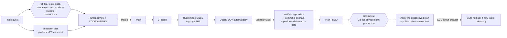

# CI/CD pipeline

Nothing reaches AWS except through a pull request that passed checks and (for production) a human approval. There are no AWS access keys in GitHub; workflows get short-lived credentials through OIDC.

## The flow

## Workflows

| Workflow | Trigger | What it does |
|---|---|---|
| `ci.yml` | every PR (and reused by deploy-dev) | Backend lint/format/tests, `pip-audit`; frontend lint/tests/build, `npm audit`; Docker build + smoke test + Trivy scan; `terraform fmt/validate`, TFLint, Checkov; gitleaks secret scan; actionlint. Final `ci-ok` job is the single required check. |
| `terraform-plan.yml` | PRs touching `infra/` | Read-only plan for dev and prod, both stacks, posted as a PR comment so reviewers see exactly what would change. |
| `deploy-dev.yml` | merge to `main`, or manual | CI, then build and push the image (skipped if that commit's image already exists), then apply dev foundation, dev API, publish the site, smoke test. No approval. Also how you bring dev back after the nightly destroy. |
| `dev-nightly-destroy.yml` | 03:00 UTC daily, or manual | `terraform destroy` on the dev **api** stack only. |
| `dev-up.yml` | manual | Recreate the dev API using the last deployed image (fast morning switch). Add a `schedule:` if you want weekday automation. |
| `deploy-prod.yml` | push a tag `v*`, or manual | Promotes the dev-tested image to production. **Pauses for approval.** |
| `infra-prod.yml` | manual | Applies changes to the always-on prod layer. **Pauses for approval.** |
| `codeql.yml` | push, PR, weekly | Static security analysis (JS and Python). |

Key properties:
- **Build once, promote.** Production never rebuilds. It deploys the image tag that was built from a commit on `main` and already ran in dev. The release job refuses tags that are not on `main` or have no image.
- **Approve what you reviewed.** Production plans are saved and the approval job applies that exact plan file. If the world changed in between, Terraform refuses instead of improvising.
- **One approval per release.** The approved job applies the API stack and publishes the site together. If the prod foundation has pending changes, the release stops and tells you to run `infra-prod` first, so that never sneaks past a reviewer.
- **Auto-rollback.** ECS's deployment circuit breaker reverts to the previous task set if the new one never becomes healthy, and `terraform apply` waits for that verdict and fails loudly.

## One-time GitHub settings

Do these after pushing the repo (all under Settings):

1. **Actions > Variables (repository):** `AWS_ACCOUNT_ID`, `AWS_REGION` (`us-east-1`), `TF_STATE_BUCKET` (from the bootstrap output). Optional, per environment: `VITE_GA_ID`, `VITE_GSC_VERIFICATION`.
2. **Environments:**
   - `dev`: no protection rules.
   - `production`: **Required reviewers** (you), **Deployment branches: main only** (tags `v*` too if you release from tags: add a tag rule), and optionally a wait timer.
3. **Branch protection (or a ruleset) on `main`:**
   - Require a pull request before merging.
   - Require status checks: `ci-ok` (and the four `plan (...)` checks if you like).
   - Require review from Code Owners (edit `.github/CODEOWNERS` first).
   - Block force pushes and deletions; require linear history; optionally require signed commits.
4. **Security:** enable Dependabot alerts and security updates, secret scanning, and **push protection**.
5. **Actions > General:** set "Fork pull request workflows" to require approval for outside contributors, and default workflow permissions to **read-only**.

### Working alone
GitHub does not let you approve your own pull request, so "require 1 approving review" will block you. Two workable options:
- Keep **required status checks** (`ci-ok`) and "require PR", but set required approvals to 0. The safety comes from CI, the Terraform plan comment, and the **production approval gate**, which you *can* approve yourself.
- Or add a second account (or a collaborator) as reviewer and keep 1 required approval, which is the closest to a real team process.

Either way, leave "Prevent self-review" **off** on the `production` environment while you are the only reviewer.

## Rolling back

- **Bad release:** run `Release to production` manually (Actions tab > Run workflow) with `image_tag` set to the previous good 12-character SHA. Same gates, same approval.
- **Bad data change:** DynamoDB point-in-time recovery is on in prod (35 days). Restoring creates a *new* table; point the app at it or copy items back.
- **Bad infra change:** revert the PR; the plan comment on the revert shows exactly what will change back.

## Things to know

- Scheduled workflows only run from the default branch, and GitHub pauses them after 60 days without repository activity. The AWS-side reaper is the backstop.
- Plan files can contain sensitive values. They are stored as private workflow artifacts for one day only.
- The plan role can read Terraform state, and state contains generated secrets (the JWT signing key and the CloudFront origin header). Keep repository write access to yourself. Rotating either is a `terraform taint` plus a deploy.
- Actions are pinned to major versions for readability. Dependabot keeps them current; pin to commit SHAs if you want the stricter supply-chain posture.
